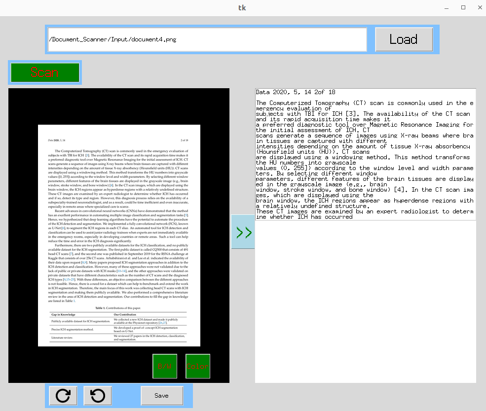

# Document Scanner with OCR

This is a Python application that simulates a simple document scanner using a webcam or static images. The tool allows you to select and correct the perspective of a document, apply filters, and extract text using OCR (Optical Character Recognition) with Tesseract.

The interface is built using Tkinter, and the image processing is powered by OpenCV and Pillow.

---

## Demo

Below is a screenshot showing the interface and a scanned document:



---

## Features

- Load images in JPG or PNG format.
- Select document corners manually using the GUI or let the app auto-detect edges.
- Scan and transform the selected area into a top-down view.
- Apply black & white or color filters to enhance the scanned output.
- Extract text using Tesseract OCR and display the results in a side panel.
- Rotate images left or right before scanning.
- Save the final output to disk.

---

## Requirements

You’ll need the following Python packages:

```bash
pip install opencv-python pillow pytesseract imutils
